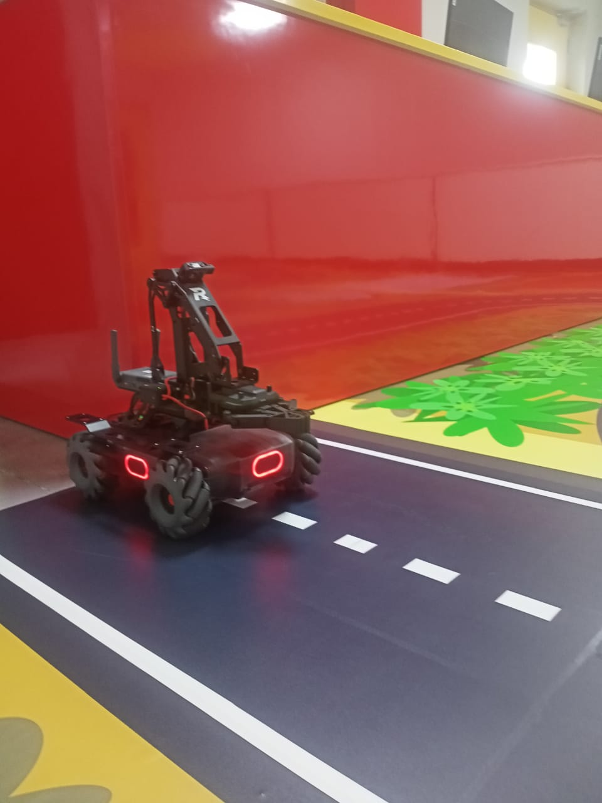
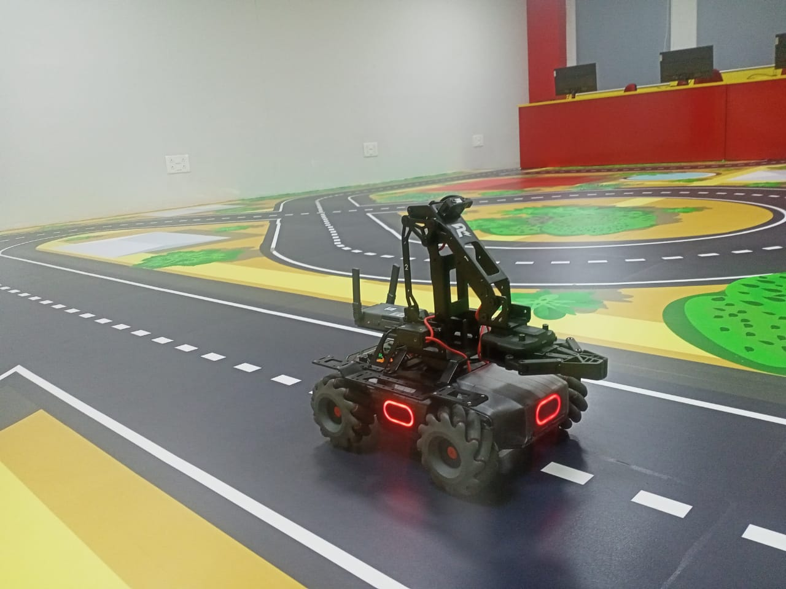

# MobileRobot-Openloopcontrol
## Aim:

To develop a python control code to move the mobilerobot along the predefined path.

## Equipments Required:
1. RoboMaster EP core
2. Python 3.7

## Procedure
### Step 1:
Initiate the MobileRobot.

### Step 2:
Connect your PC with the MobileRobot.

### Step 3:
Open Python program.

### Step 4:
Program the movements of the robot using python code.

### Step 5:
Execute the python program.

## Program
```python
from robomaster import robot
import time

if __name__ == '__main__':
    ep_robot = robot.Robot()
    ep_robot.initialize(conn_type="ap")

    ep_chassis = ep_robot.chassis

    '''
    x = x-axis movement distance,( meters) [-5,5]
    y = y-axis movement distance,( meters) [-5,5]
    z = rotation about z axis ( degree)[-180,180]
    xy_speed = xy axis movement speed,( unit meter/second) [0.5,2]
    '''
    ep_chassis.move(x=3, y=0, z=0, xy_speed=1).wait_for_completed()

    ep_chassis.move(x=0, y=0, z=50, xy_speed=1).wait_for_completed()

    ep_chassis.move(x=3.2, y=0, z=0, xy_speed=1).wait_for_completed()

    ep_chassis.drive_speed(x=0.2,y=0,z=-9)
    time.sleep(26)
    ep_chassis.move(x=3, y=0, z=0, xy_speed=1).wait_for_completed()
    ep_chassis.move(x=0, y=0, z=35, xy_speed=1).wait_for_completed()
    ep_chassis.move(x=0.8, y=0, z=0, xy_speed=1).wait_for_completed()
    ep_chassis.move(x=0, y=0, z=60, xy_speed=1).wait_for_completed()
    ep_chassis.move(x=0.3, y=0, z=0, xy_speed=1).wait_for_completed()
    ep_chassis.move(x=0, y=0, z=20, xy_speed=1).wait_for_completed()
    ep_chassis.move(x=0.3, y=0, z=0, xy_speed=1).wait_for_completed()
    ep_chassis.move(x=0, y=0, z=19, xy_speed=1).wait_for_completed()
    ep_chassis.move(x=3.5, y=0, z=0, xy_speed=1).wait_for_completed()
    ep_chassis.drive_speed(x=0,y=0,z=360)
    time.sleep(5)
    ep_robot.close()
```

## MobileRobot Movement Image:





## MobileRobot Movement Video:
[

### https://youtube.com/shorts/56iA5aIbTvM?feature=share
<br/>
<br/>
<br/>
<br/>

## Result:
Thus the python program code is developed to move the mobilerobot in the predefined path.


<br/>
<br/>

```
Mobile Robotics Laboratory
Department of Artificial Intelligence and Data Science/ Machine Learning
Saveetha Engineering College
```
